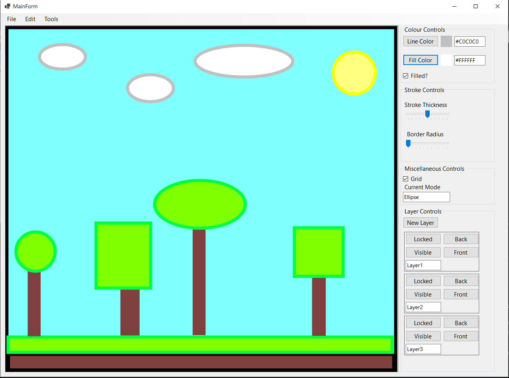
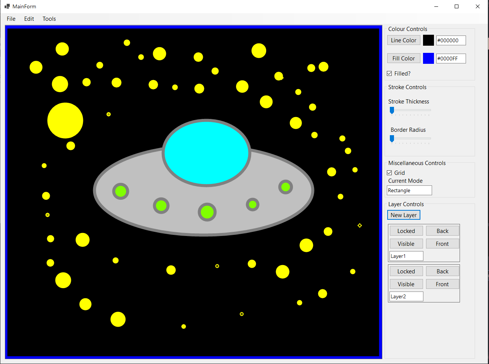
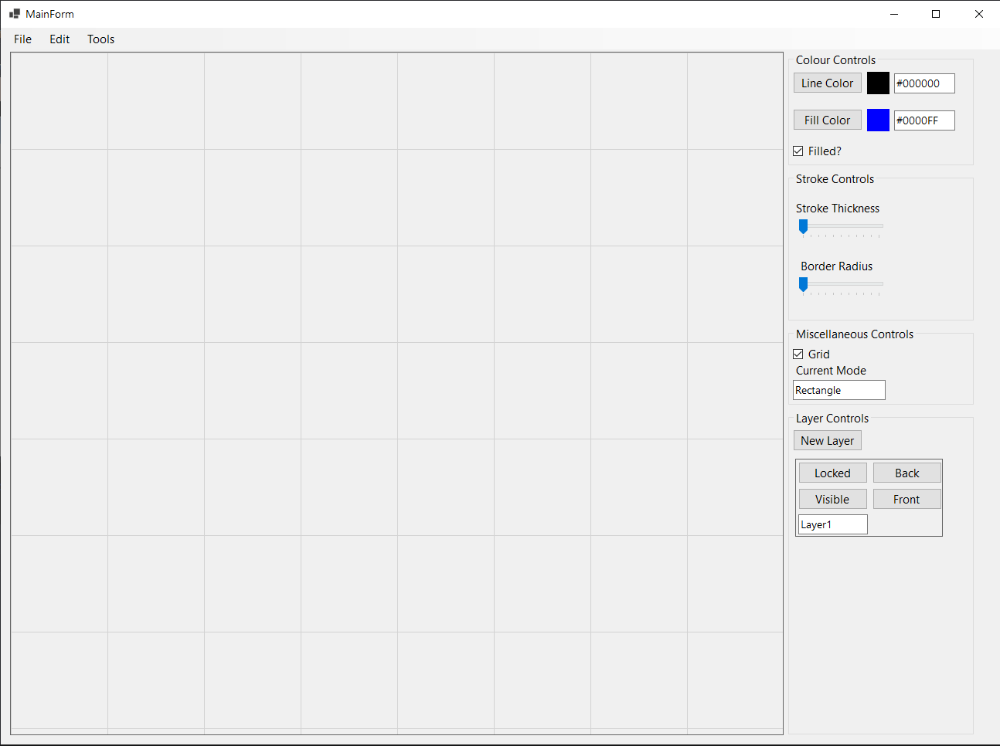
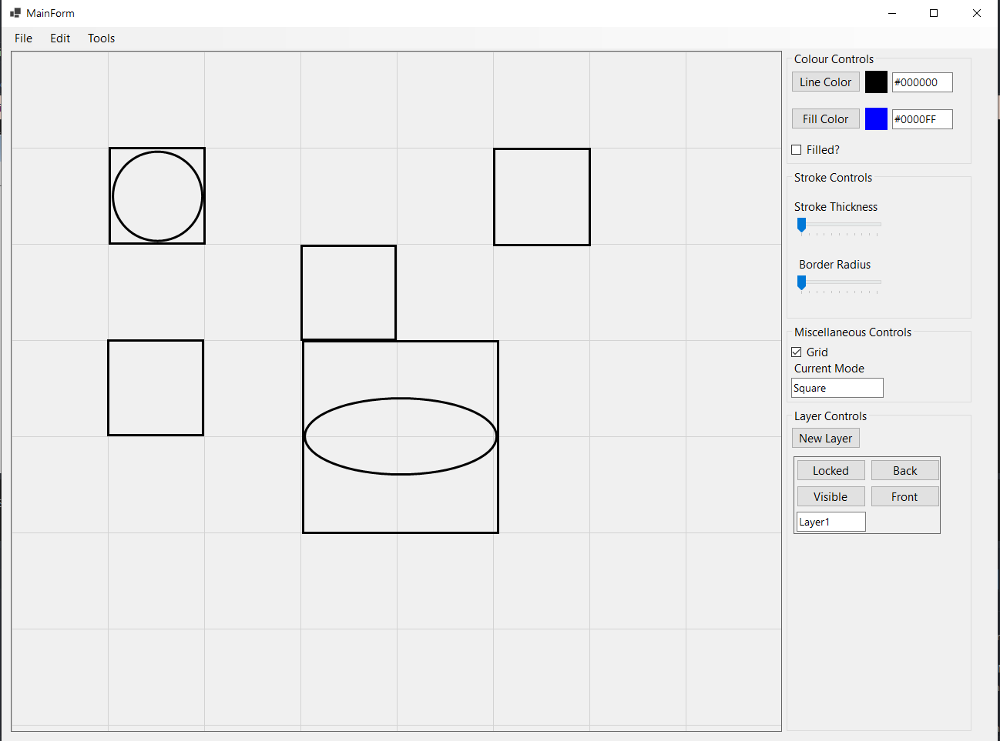

# SVG_editor_finalproject

This is a simple Windows Forms app developed in C# which allows the user to draw a variety of shapes to create an SVG document. I developed this app for my final project

The primary features as as follows:
  - Shape tool which supports Squares, Rectangles, Circles and Ellipses
  - Colour tools which show the Hexadecimal value of the current colour
  - Undo and Redo changes
  - Background grid for easy alignment
  - Saving and Opening JSON files
  - Export file to SVG
  - Select tool 
  - Editable Layers

# Libraries Used

  - <a href="https://github.com/svg-net/SVG">SVG.NET</a> -> SVG graphics. 
  -  <a href="https://github.com/cdiggins/svg-editor">https://github.com/cdiggins/svg-editor</a> -> written by my professor, project ideas and skeleton
  -  Windows Forms

# Screenshots

# How to Use

- Download executable from Releases section
- Default shape tool is Rectangle but can be changed under Tools dropdown menu
- Layers can be added by pressing "New Layer", click inside the layer control to draw on that layer
- Keybinds for commands can be seen in dropdown menus

# Known Issues

  - Undo and Redo are broken, not allowing the user to continue drawing afterwards
  - The Selection tool does not allow the user to deselect a shape after selecting
  - Executable downloaded directly from Releases will not work reliably

# What's Next

  - Improve the Hexadecimal colour feature to allow the user to enter a specific Hexadecimal value to select a colour
  - Refactoring and reorganizing of code
  - Polish the application UI
  - Update Releases with a proper executable
